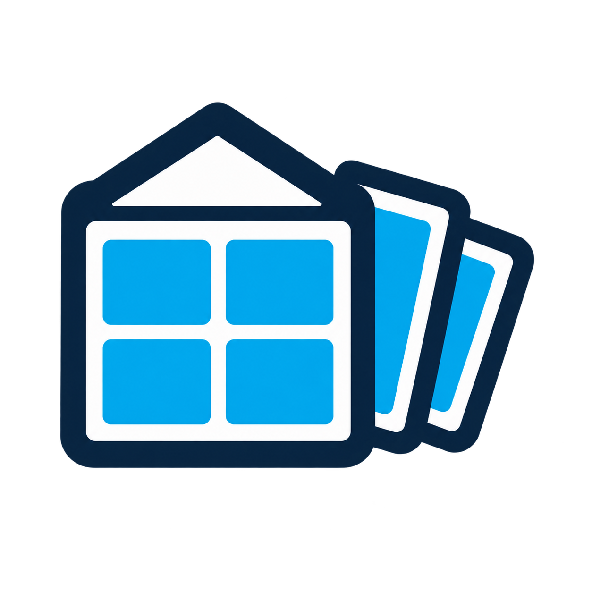

# HA-Wallpanel

<p align="center">
  
</p>

HA-Wallpanel bündelt die Funktionen für ein fest installiertes Home-Assistant-Display in einer Integration: einen globalen Lovelace-Bildschirmschoner und einen per URL aktivierbaren Kioskmodus.

Die Konfiguration erfolgt unter **Einstellungen → Geräte & Dienste**. Eine zusätzliche unsichtbare Dashboard-Karte oder manuell angelegte JavaScript-Ressource ist nicht erforderlich.

## Voraussetzungen

- Home Assistant 2026.8.2 oder neuer
- ein moderner Browser mit Unterstützung für Web Components und Shadow DOM

## Funktionen

- Bildschirmschoner auf jeder mit `?kiosk` geöffneten Home-Assistant-Seite
- eingebaute und benutzerdefinierte Home-Assistant-Dashboards sowie einzelne Ansichten als Vollbild-Panels
- normale Lovelace-Karten als Vollbild-Panels
- eine gemeinsame, frei sortierbare Reihenfolge für Ansichten, Karten und Farben
- optionale Zufallswiedergabe ohne direkte Wiederholung desselben Panels
- täglicher Zeitplan mit statischem Panel, Überblenden auf Schwarz oder vollständig deaktiviertem Screensaver
- einstellbare Inaktivitäts-, Anzeige- und Überblendzeit
- beliebig viele einfarbige Vollbild-Panels mit nativer Farbauswahl
- optionale Seitenanzeige und ausgeblendeter Mauszeiger
- Rückkehr zum Dashboard bei Touch, Klick, Mausbewegung, Tastendruck oder Mausrad
- Live-Übertragung geänderter Einstellungen an verbundene Frontends
- Kioskmodus über den URL-Parameter `?kiosk` mit ausgeblendeter Seitenleiste, Titelzeile und Scrollleiste
- keine externen JavaScript- oder Python-Abhängigkeiten

## Kioskmodus

Zum Ausblenden von Home-Assistant-Seitenleiste und Dashboard-Titelzeile wird `?kiosk` an die Wallpanel-URL angehängt:

```text
http://homeassistant.local:8123/dashboard-1/grundriss?kiosk
```

Enthält die URL bereits andere Parameter, wird stattdessen `&kiosk` verwendet. Der Kioskmodus bleibt bei der Navigation zwischen Home-Assistant-Ansichten innerhalb derselben Browser-Sitzung aktiv. Zum Beenden den Parameter aus der URL entfernen und die Seite neu laden.

Der Modus ist gerätebezogen: Nur Browser beziehungsweise Displays, deren URL `kiosk` enthält, werden in die reduzierte Darstellung versetzt. Die Scrollleiste wird dabei ausgeblendet; Scrollen per Touch, Mausrad oder Trackpad bleibt möglich. Andere Home-Assistant-Clients bleiben unverändert.

Auch der Bildschirmschoner wird ausschließlich im Kioskmodus aktiviert. Normale Dashboard-Sitzungen ohne `kiosk` starten keinen Inaktivitäts-Timer.

## Manuelle Testinstallation

Das Repository bleibt bis zum Abschluss der Tests unveröffentlicht. Für die lokale Installation:

1. Den Ordner `custom_components/ha_wallpanel` nach `/config/custom_components/ha_wallpanel` kopieren.
2. Home Assistant Core neu starten.
3. **Einstellungen → Geräte & Dienste → Integration hinzufügen** öffnen.
4. Nach **HA-Wallpanel** suchen und die Integration hinzufügen.
5. Den Browser beziehungsweise die Home-Assistant-App vollständig neu laden.

Das Frontend-Modul wird von der Integration automatisch bereitgestellt und registriert.

## Screensaver-Konfiguration

Bei der Einrichtung und später über **Konfigurieren** stehen folgende Optionen zur Verfügung:

| Option | Standard | Beschreibung |
| --- | ---: | --- |
| `enabled` | `true` | Aktiviert oder deaktiviert den Bildschirmschoner. |
| `views` | leer | Eingebaute und benutzerdefinierte Dashboards sowie Lovelace-Ansichten aus einem Dropdown mit Mehrfachauswahl. |
| `idle_time` | `60` | Sekunden ohne Bedienung bis zum Start. |
| `display_time` | `15` | Rotationszeit je Panel; jederzeit einstellbar und ab zwei Panels wirksam. |
| `transition_time` | `1.5` | Dauer der Einblendung und des Panelwechsels. |
| `colors` | leer | Eigene einfarbige Vollbild-Panels mit Colorpicker, sichtbarem Farbfeld und Hexwert. |
| `panel_order` | automatisch | Gemeinsame Reihenfolge aller Ansichten, Karten und Farben. |
| `shuffle` | `false` | Spielt die ausgewählten Panels in zufälliger Reihenfolge ab. |
| `schedule_enabled` | `false` | Aktiviert einen täglichen Sonderzeitraum. |
| `schedule_start` | `22:00` | Beginn des täglichen Sonderzeitraums in der Home-Assistant-Zeitzone. |
| `schedule_end` | `06:00` | Ende des Sonderzeitraums und Rückkehr zur normalen Rotation. |
| `schedule_mode` | `black` | Zeigt Schwarz, ein statisches Panel oder gar keinen Screensaver. |
| `schedule_panel` | erstes Panel | Panel für den statischen Zeitplan-Modus. |
| `show_progress` | `false` | Zeigt unten optional einen Seitenindikator. |
| `hide_cursor` | `true` | Blendet den Mauszeiger im Screensaver aus. |
| `cards` | leer | Vollbild-Panels, die über Home Assistants nativen Kartenbrowser und Karteneditor hinzugefügt werden. |

Direkt unter **Aktiviert** stehen die drei Aktionen **Ansicht hinzufügen**, **Dashboard-Karte hinzufügen** und **Farbe hinzufügen**. Darunter zeigt HA-Wallpanel alle ausgewählten Elemente in einer gemeinsamen Liste; sie lassen sich dort auch über Typgrenzen hinweg sortieren. Die Ansichten-Auswahl enthält eingebaute Ziele wie **Eingebaut › Übersicht** und **Eingebaut › Energie**, benutzerdefinierte Dashboards wie **Vom Benutzer erstellt › Dashboard** sowie deren einzelne Ansichten. Sie sind im Screensaver nicht bedienbar, damit jede Eingabe zuverlässig zum eigentlichen Wallpanel zurückkehrt.

Beim Klick auf **Hinzufügen** öffnet sich derselbe visuelle Kartenbrowser wie beim Bearbeiten eines Dashboards. Nach der Kartenauswahl folgt Home Assistants normaler Karteneditor; HA-Wallpanel übernimmt die fertige Konfiguration anschließend als Vollbild-Panel. Vorhandene Einträge lassen sich im Konfigurationsdialog weiterhin bearbeiten, sortieren oder löschen.

Vor dem Öffnen lädt HA-Wallpanel die registrierten Lovelace-Ressourcen, damit auch ordnungsgemäß für Home Assistants Kartenbrowser registrierte HACS-Karten erscheinen. Kartentitel werden aus Home Assistants Lovelace-Übersetzungen übernommen. Der **Bearbeiten**-Knopf einer gespeicherten Karte öffnet ebenfalls den nativen visuellen Editor. YAML wird nur als Ausweichmodus verwendet, wenn eine Karte keinen eigenen visuellen Editor bereitstellt.

Karten mit einem ausschließlich im Dashboard-Bearbeitungsmodus verfügbaren Vollbild-Designer erhalten zusätzlich einen **Designer**-Knopf. HA-Wallpanel zeigt ihn nur für ausdrücklich unterstützte Kartentypen an; derzeit ist `custom:wall-clock-card` integriert. Änderungen aus diesem Designer werden direkt zurück in die Wallpanel-Konfiguration geschrieben, ohne ein echtes Dashboard zu verändern.

Im YAML-Editor wird dabei nur die eigentliche Kartenkonfiguration eingetragen. HA-Wallpanel erzeugt die umgebende Panel-Ansicht intern, setzt den Home-Assistant-Layoutkontext auf `panel` und entfernt Kartenrand sowie Schatten. Eine äußere Struktur mit `type: panel`, `path`, `background` und `cards` ist daher nicht erforderlich. Bereits so gespeicherte Konfigurationen mit genau einer enthaltenen Karte werden automatisch übernommen und auf die Kartenkonfiguration reduziert.

Der optionale tägliche Zeitplan darf über Mitternacht gehen, beispielsweise von `22:00` bis `06:00`. Innerhalb dieses Fensters kann die normale Rotation durch genau ein ausgewähltes Panel ersetzt werden, mit der eingestellten Überblendzeit auf Schwarz wechseln oder vollständig ausgesetzt werden. Beginnt oder endet das Zeitfenster bei bereits aktivem Screensaver, wird der Modus automatisch umgeschaltet. Eine spätere erweiterte Zeitplanung mit mehreren Regeln und Wochentagen kann auf dieser Konfiguration aufbauen.

HA-Wallpanel lädt das dafür benötigte Lovelace-Modul über Home Assistants eigenen Panel-Loader. Dadurch funktioniert der Kartenbrowser auch dann, wenn die Einstellungen direkt nach einem Seitenaufruf geöffnet wurden. Auf breiten Dialogen stehen die drei Zeitwerte platzsparend nebeneinander; auf schmalen Displays bleiben sie untereinander mit reduzierten Abständen.

Das Beenden des Screensavers durch Touch, Klick, Mausbewegung, Mausrad oder Tastendruck erfolgt sofort ohne Ausblendanimation. Beim Start verschwindet der Mauszeiger nach genau der konfigurierten Einblendzeit. Die eingestellte Übergangszeit gilt außerdem beim Wechsel zwischen Screensaver-Panels.

Beispiele für mögliche Kartenkonfigurationen:

```yaml
- type: weather-forecast
  entity: weather.forecast_home
  show_forecast: true

- type: grid
  columns: 2
  square: false
  cards:
    - type: tile
      entity: sensor.wohnzimmer_temperatur
      name: Wohnzimmer
    - type: tile
      entity: sensor.wohnzimmer_luftfeuchtigkeit
      name: Luftfeuchtigkeit
```

## Architektur

Das Python-Backend speichert und validiert die Einstellungen als Home-Assistant-Config-Entry. Ein automatisch geladenes Frontend-Modul empfängt die Konfiguration über Home Assistants authentifizierte WebSocket-Verbindung und verwaltet Bildschirmschoner und Kioskmodus global.

## Wechsel von der frühen Testkarte

Nach erfolgreichem Integrationstest können die alte Screensaver-Karte und ihre manuell eingetragene Ressource aus dem Dashboard entfernt werden. Für den abschließenden Test sollte nur HA-Wallpanel aktiv sein.

## Installation über HACS

Für die spätere Veröffentlichung wird das Repository als Typ **Integration** geführt. HACS installiert `custom_components/ha_wallpanel` automatisch. Das Repository muss vor einer öffentlichen HACS-Installation öffentlich sein.

Ab Home Assistant 2026.3 liefert die Integration ihre eigenen Brand-Icons direkt im Ordner `custom_components/ha_wallpanel/brand` mit. Dadurch erscheint das HA-Wallpanel-Logo lokal unter **Geräte & Dienste**, ohne einen separaten Eintrag im Home-Assistant-Brands-Repository.

## Entwicklung und Tests

Benötigt werden Node.js 20 oder neuer und Python 3.13:

```bash
npm test
npm run check
```

Der Build erzeugt das auszuliefernde Frontend unter `custom_components/ha_wallpanel/frontend/ha-wallpanel.js`. Die Quelldatei liegt unter `src/ha-wallpanel.js`.

Die automatisierten Tests prüfen Frontend-Konfiguration, Kiosk-Freigabe, Ansichten-, Karten- und Farb-Panels, Eingabe-Abbruch, Backend-Validierung und Zeitwerte.

## Lizenz

HA-Wallpanel wird unter der [MIT-Lizenz](LICENSE) veröffentlicht.
